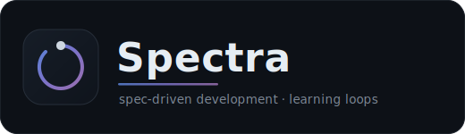
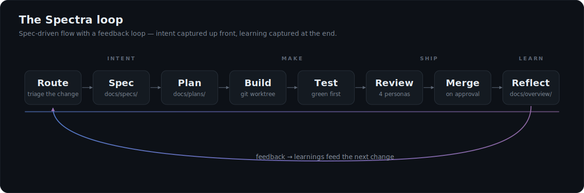

<p align="center">
  
</p>

<p align="center">
  <strong>Spec-driven development with learning feedback loops — installable into any repo in three commands.</strong>
</p>

AI-assisted development is fast but forgetful. The spec lives in a chat message, the
reasoning behind a decision evaporates, and the same mistakes come back next week. Spectra
fixes that by making intent explicit *before* you build and capturing learning *after* —
all in version control, all driven by your coding agent.

It's packaged natively for **Claude Code, OpenAI Codex, and Cursor** — one source of truth,
one set of commands — so any repo can adopt the entire protocol (the workflow, the review
personas, the artifact structure, and a reflection reminder) without copy-pasting a thing.

## Quick start

Install through your agent's native plugin system, then run `/spectra-install` in the repo
you want to adopt it.

**Claude Code**
```text
/plugin marketplace add mattmaynes/spectra
/plugin install spectra@spectra
/spectra-install
```

**OpenAI Codex**
```text
codex plugin marketplace add mattmaynes/spectra
```
Then install the **spectra** plugin from that marketplace and run `/spectra-install`.

**Cursor**

Add the `mattmaynes/spectra` marketplace (in-editor marketplace panel or `/add-plugin`), then
run `/spectra-install`.

All three install the **same** protocol, personas, and reflection hook from one shared source —
the agent reads it via `AGENTS.md` (Claude through a `CLAUDE.md` symlink; Codex and Cursor
natively). `/spectra-install` scaffolds your repo, drops in the protocol and review personas,
installs a reflection hook, and points your `AGENTS.md` at it. Later, pull updates with
`/spectra-update`.

## The protocol

<p align="center">
  
</p>

Every change flows through one loop (full text: [`spectra/protocol.md`](spectra/protocol.md)):

| # | Step | What happens |
|---|---|---|
| 1 | **Route** | Trivial change? do it. New feature? write a **spec**. Bug or friction? write **feedback** (so it becomes a lesson). |
| 2 | **Spec** | Developer approves before any code is written (`docs/specs/NNNN-*.md`). |
| 3 | **Plan** | Multi-step work becomes an ordered plan (`docs/plans/NNNN-*.md`). |
| 4 | **Build** | Executed in a git worktree on a branch. |
| 5 | **Test** | Run the suite and fix until green **before committing** (no suite? add the test that proves the change). |
| 6 | **Review** | A PR is reviewed by the **personas you've enabled** (engineer, tester, architect, security by default — see [Skills](#skills)) who comment in a fixed format; `major`/`blocker` findings become learnings. |
| 7 | **Merge** | On approval. |
| 8 | **Reflect** | Before concluding, the **living docs** in `docs/overview/` (`project`, `features`, `architecture`, `learnings`) are updated. A non-blocking `pre-commit` hook nudges you if you forget. |

Step 8 is the differentiator: the **feedback → learnings** loop means the system gets
better at *your* codebase over time, instead of repeating itself.

## Skills

Spectra installs as a handful of slash commands (agent skills). Run them from the repo
where Spectra is installed:

| Command | What it does |
|---|---|
| `/spectra-install` | Adopt Spectra in the current repo — scaffolds `docs/`, copies the protocol and review personas, seeds the enabled-persona config, installs the reflection hook, and wires up `AGENTS.md`. |
| `/spectra-update` | Re-sync the Spectra-owned files to the installed plugin version (protocol, personas, host block, hook). Leaves your `specs/plans/feedback/overview`, your `personas.config`, and your `user.md` untouched. |
| `/spectra-setup` | Define your repo's 👤 *User (ICP)* review persona through a short guided dialog, so reviews can judge a change on your customer's behalf. Re-run to refine it. |
| `/spectra-enable` *`[persona]`* | Turn on a review persona. With no argument, lists the personas available to enable as a numbered menu. |
| `/spectra-disable` *`[persona]`* | Turn off a review persona (a core one too). With no argument, lists the personas currently enabled. |

### Review personas

Each PR is reviewed only by the personas you've **enabled** (tracked in
`docs/spectra/personas.config`) whose facet the change actually touches — so reviews stay
scoped, not eight bots on every diff. Four ship on by default, three more are available, and one
is yours to define:

| Persona | Default | Reviews for |
|---|---|---|
| 🔧 **engineer** | on | correctness, edge cases, maintainability |
| 🧪 **tester** | on | coverage, edge cases, honest tests |
| 📐 **architect** | on | boundaries, dependencies, design-for-change |
| 🔒 **security** | on | auth, input handling, secrets, dependencies |
| 🎨 **designer** | off | visual consistency, spacing, design tokens, clear calls-to-action |
| ⚖️ **compliance** | off | accessibility, PII minimization, i18n, GDPR/CCPA |
| 📊 **analytics** | off | event tracking, measurable outcomes, feature-gate metrics |
| 👤 **user (ICP)** | `/spectra-setup` | whether the change actually serves your ideal customer |

Flip any of them with `/spectra-enable` / `/spectra-disable`. A disabled persona costs nothing —
its checklist only loads when it's both enabled and scoped into a review.

## Own your protocol

Spectra isn't a SaaS, a runtime, or an API you call out to — it's a handful of Markdown
files that live **in your repo**, under your version control, read by the coding agent you
already use. That changes what you're adopting:

- **It's yours to edit.** `protocol.md` and the personas are plain prose. Tighten a step,
  add a persona, rename an artifact directory — it's a text change, reviewed like any other.
- **No third-party dependency.** Nothing phones home; there's no account and no lock-in.
  Uninstall the plugin and the `docs/` it scaffolded keep working on their own.
- **Opinionated, but flexible.** The defaults encode a real workflow (route → spec → … →
  reflect) so you don't start from a blank page — yet every default is just a starting
  point you can override per repo.
- **Versioned like code.** Because the protocol is committed, changes to *how you build*
  show up in `git log` right next to changes to *what you built*.

`/spectra-update` re-syncs only the files you haven't claimed as your own, so customizing
the protocol and pulling upstream improvements aren't mutually exclusive.

## Low token cost

Spectra is deliberately terse — the whole protocol fits in a corner of the context window,
leaving room for your actual code:[^tokens]

<!-- spectra:tokens:start -->
| What loads into context | Characters | Tokens (≈4 ch) |
|---|---|---|
| Always-on host block (in `AGENTS.md`) | 693 | **173** |
| Protocol only (no personas needed) | 4,347 | **1,087** |
| Full protocol + core personas | 10,072 | **2,518** |
| Optional personas (load only when enabled) | 2,636 | **659** |
| Everything, incl. install/update skills | 26,008 | **6,502** |
<!-- spectra:tokens:end -->

## What lands in your repo

```
docs/
  spectra/protocol.md      the protocol (agent reads this)
  spectra/personas/*       review lenses (all shipped; enable the ones you want)
  spectra/personas.config  which review personas are enabled (yours to edit)
  specs/                   approved specs (NNNN-<slug>.md)
  plans/                   ordered build plans (NNNN-<slug>.md)
  feedback/                bugs & friction → lessons (NNNN-<slug>.md)
  overview/                living docs, updated every change
AGENTS.md                  points your agent at Spectra
.git/hooks/pre-commit      reflection reminder (copied in; not tracked)
```

## Repo layout (this repo)

- **`spectra/`** — the shippable source of truth: the plugin (skills, protocol, personas,
  hook). This is what gets installed.
- **`docs/`** — Spectra dogfooding itself: this repo built using its own protocol.
- **`assets/`** — the logo and protocol diagram (SVG) used by this README.
- **`scripts/`** — repo-local tooling, not shipped: `token-report.sh` keeps the token
  figures above honest (enforced by a `pre-commit` guard and `test.sh`).

## License

See [LICENSE](LICENSE).

[^tokens]: Measured from the Markdown in `spectra/` with a dependency-free ~4 chars/token
    heuristic, and kept in sync with the source automatically.
